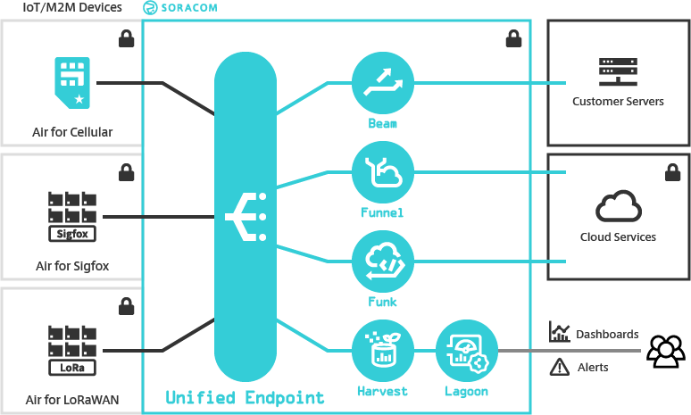

copyright 2021 (c) Soracom

MIT Licence

# Soracom Metadata
This sketch will pull data from the Soracom Cloud Metadata service over the wireless network.



Additional information on Soracom Metadata is available online at [Soracom Metadata](https://developers.soracom.io/en/docs/air/metadata-service/).  Access to the Soracom console is at [Soracom Console](https://console.soracom.io).

## Required Arduino Libraries:

- [Arduino](https://github.com/arduino/Arduino)
- [MKRGSM](https://github.com/arduino-libraries/MKRGSM)
- [ArduinoJson](https://arduinojson.org/?utm_source=meta&utm_medium=library.properties)
## Program setup

### Getting started

1. Install a Soracom SIM card into the SIM slot on the underside of the Arduino MKR GSM module.
1. Connect the GSM Antenna to the module.
1. Make the USB connection between the Arduino MKR 1400 your Arduino IDE (PC).
1. Use the Arduino IDE to verify and upload the Arduino image to the MKR GPS 1400, you may need to install additional libraries from the IDE (CTRL SHIFT I) to verify and upload the sketch.
1. Start the serial monitor, the serial connection speed is set by `#define SERIAL_SPEED 9600` at 9600 bps
1. The sketch will send one request to the Metadata Service, print the result and then sleep.

Please note;
- Your USB PSU (Power Supply) should be rated for at least 2A, the GSM radio transmitter when operating requires high current.
- LED_BUILTIN will light for the time it takes to pull data over the network from Soracom Metadata.  LED_BUILTIN is the ORANGE LED close to the I2C interface and on the same side of the MKR module as the GREEN power LED.
- A modem reset can take up to 10 seconds and may delay output on the Serial console.

## Console output at the Serial port
The sketch will wait for 60 seconds for the IDE to attach to the Serial port.  After the 60 second timeout the sketch will continue.  LED_BUILTIN is also used to show progress through the test.

```text
17:24:46.560 ->
17:24:46.560 -> Starting Soracom CONFIG test..
17:24:46.560 -> Starting Modem, GSM, GPRS and Soracom Cloud connection
17:24:46.659 -> 	[1/5] GSM_READY * Modem IMEI : 357520078534019 SIM ICCID : 8942310019001627660
17:24:57.207 -> 	[2/5] GPRS_READY *
17:25:00.922 -> 	[3/5] Cloud Connection TRUE *
17:25:19.965 -> .	[4/5] Requesting update from Soracom Metadata
17:25:20.960 ->
17:25:20.960 -> GET /v1/userdata HTTP/1.1
17:25:20.960 -> Host: metadata.soracom.io
17:25:20.993 -> User-Agent: Soracom/1.0
17:25:21.026 -> Accept: application/json
17:25:21.026 -> X-Clacks-Overhead: GNU Terry Pratchett
17:25:21.059 -> Connection: close
17:25:21.092 ->
17:25:21.126 -> ..........	[5/5] Awaiting reply
17:25:31.212 ->
17:25:31.212 -> HTTP/1.1 200 OK
17:25:31.212 -> Content-Type: application/json
17:25:31.212 -> Content-Length: 53
17:25:31.212 -> Date: Fri, 22 Jan 2021 17:25:30 GMT
17:25:31.212 -> Connection: close
17:25:31.245 ->
17:25:31.245 -> {"PTCL":"HTTP","HST":"unified.soracom.io","PRT":"80"}
17:25:31.510 ->
17:25:31.510 -> Configuration from Soracom Metadata service
17:25:31.510 -> Application Protocol :	HTTP
17:25:31.510 -> Interface Name :	unified.soracom.io
17:25:31.510 -> Interface Port :	80
17:25:31.510 ->
17:25:31.510 -> client.stop
17:25:31.510 -> gprs.detachGPRS : 1
17:25:42.422 -> gsmAccess.shutdown : 1
17:25:44.678 -> .............
```
- The text starting `GET /v1/userdata HTTP/1.1` is the content of our request to the metadata WEB Server interface.
- The text starting `HTTP/1.1 200 OK` is the content of the reply from the metadata WEB Server interface.

## LED_BUILTIN
- Flashing; - Startup, awaiting Serial connection from the Arduino IDE.  This will timeout after 60 seconds.
- OFF; Connecting to the GSM & GPRS network.
- ON; Connected to Soracom Cloud & getting data.
- OFF; Finished.

## Code Cuts
- Attach to the GSM & GPRS networks `gsmAccess.begin(PINNUMBER, true, true);`  `gprs.attachGPRS(GPRS_APN, GPRS_LOGIN, GPRS_PASSWORD, true);`
- Connect to Soracom Metadata `client.connect(METADATA_SERVER, METADATA_PORT)`
- Begin sending getting to the Soracom cloud interface `client.print(http_request[i]);`

### Wait for IDE connection with timeout
```c
  for (int i = 0; i <= 60; i++)
    while (!Serial)
    {
      delay(1000);
    }
```
### Static Variable
The content (value) of a 'static' variable persists, for example value of 'tsStart' in function timerExpired() persists between calls to the function, the value of the variable is initialized the first time the function is called and retains its setting between calls.

```c
	static unsigned long tsStart = millis();
```

### Using FLASH memory for static data
The 'F("STRING")' construct places static data into flash storage, preserving RAM for your code.

```c
	Serial.println(F("Starting Soracom CONFIG test.."));
```
